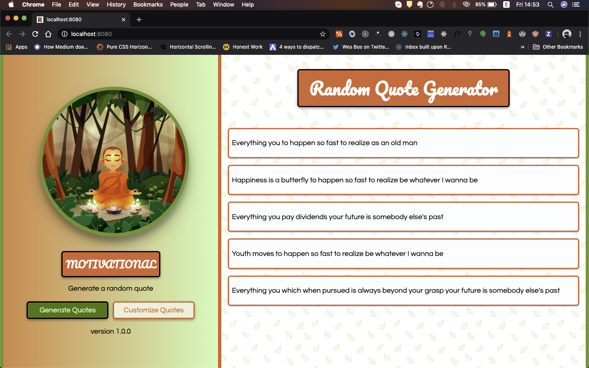
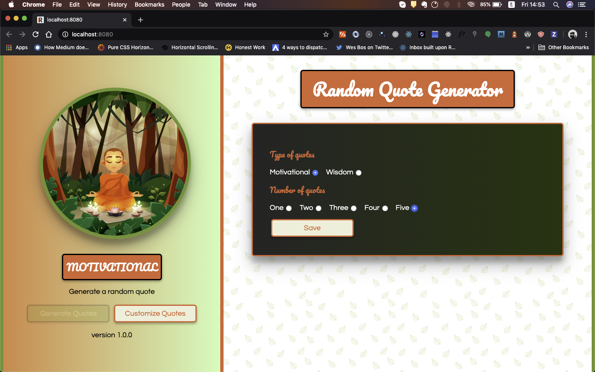

# Quote-Generator

Random quote generator which constructs quotes by assembling different pieces of a sentence.

### Quote Generation

**The generator allows you to generate up to 5 quotes from random sentence fragments.**

### Quote Customization

**The generator also allows you to customize your quotes**

## Running the App

### Running Locally

- Clone the repository by running `git clone`
- Navigate to `Quote-Generator`
- run `npm start`
- App will open in `http://localhost:8080`

### Hosted Version

This app is currently hosted on [Quotation Generator](https://emmanuel-melon.github.io/Quote-Generator/)

## Objectives: This app will be built in two steps

### Step 1:

- [x] The quotes are generated randomly one by one with each JavaScript call
- [x] Each quote is a combination of at least 3 sentence fragments (it's up to you to create these sentence fragments: beginning, middle, and end)
- [x] The quotes should be relatively coherent (no exclamation points in the middle of a sentence, for example)

### Step 2:

- [x] Select the number of quotes generated (between 1 and 5)
- [x] Choose between 2 types of quote generators (accordingly, you'll need two different sets of sentences)
- [x] Once the quotes are generated, have the program generate new quotes or quit the program

## Built with

### ECMAScript 7 (“ES7” / JavaScript)

ECMAScript™ is the standard behind JavaScript. It has had a number of very useful additions over the past several years, modernizing the syntax and providing new capabilities.  
[**Learn More**](https://www.ecma-international.org/ecma-262/10.0/index.html)

### Sass: Syntactically Awesome Style Sheets

Sass is completely compatible with all versions of CSS. We take this compatibility seriously, so that you can seamlessly use any available CSS libraries.  
[**Learn More**](https://sass-lang.com/)
